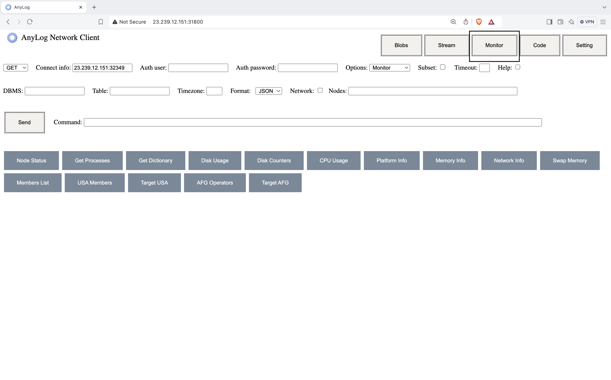
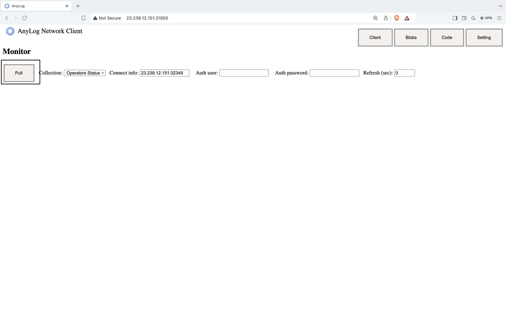
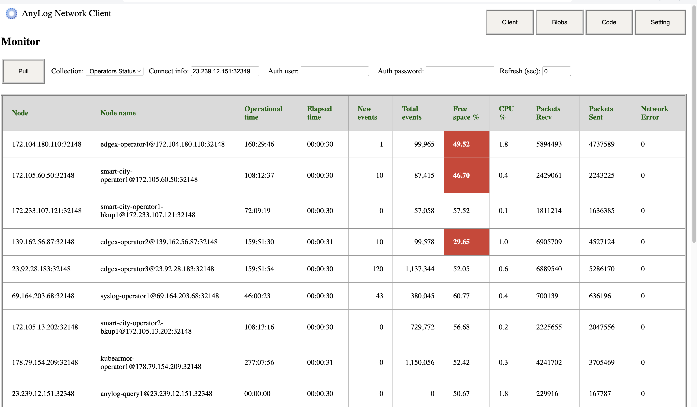

# Monitoring
Nodes in the network can collect and monitor information on data and state. The collected information can be retrieved 
from the node, or collected in a database or send to an aggregator node where data from multiple nodes is aggregated and 
available to query.

<ul>
    <li>Data ingested to local databases and data volumes in the tables.</li>
    <li>Performance of Queries</li>
    <li>Physical Machine Utilization</li>
</ul>

## Monitoring Commands

<h3>Data Monitoring</h3>
An operator nodes stores data coming from different devices, and often times partitioned based on the needs of the user.
One of the ways to monitor said data is by looking at things like row count and how much data is flowing in. 

<ul>
    <li>View tables in databases, and the number of rows in each table.</li>
<pre class="code-frame"><code class="language-anylog">get rows count where dbms = [dbms name] and table = [table name] and format = [table | json] and group = [partition/table]</code></pre>
    <ul><b>Notes</b>
        <li>If a dbms is not set, then rows for all tables in all local database will be provided</li>
        <li>If a dbms is set and table is not, then rows for all tables inn the given database will be provided</li>
        <li><i>group</i> variable determines if rows count are presented for each partition (the default) or aggregated and presented for each table</li>
    </ul>
     
    <li>View ingestion of data by an Operator node</li>
<pre class="code-frame"><code class="language-anylog"># General command
get operator
# Operator statistics
get operator stat format = [table | json]</code></pre> 
    <li>Lists the Operator nodes in the network and the tables supported on each node</li>
<pre class="code-frame"><code class="language-anylog">get data nodes where format=[table | json]</code></pre>
    <li>The streaming buffers status</li>
<pre class="code-frame"><code class="language-anylog">get streaming where format=[table | json]</code></pre>
</ul>

<h3>Query Monitoring</h3>
Similar to monitor data coming in, users can also monitor the performance of queries. This is done by 2 commands: 
<ul>
    <li>Status of the executed query or queries</li>
<pre class="code-frame"><code class="language-anylog">query status [all/ID]</code></pre>
    <li>Status of query threads assigned.</li>
<pre class="code-frame"><code class="language-anylog">get query pool</code></pre>
    <li>Statistics on queries execution time</li>
<pre class="code-frame"><code class="language-anylog">get queries time where format=[table | json]</code></pre>
</ul>

<h3>Node Monitoring</h3>
Like operator and query insight, EdgeLake allows to view the state of the node, even from within Docker / Kubernetes 
deployment.    
<ul>
    <li>Base machine platform information</li>
<pre class="code-frame"><code class="language-anylog">get platform info</code></pre>
    <li>Breakdown of Memory resources</li>
<pre class="code-frame"><code class="language-anylog">get memory info</code></pre>
    <li>Breakdown of CPU insights</li>
<pre class="code-frame"><code class="language-anylog"># Number of CPUs 
get cpu info
# CPU temperature
get cpu temperature
# CPU utilization
get cpu usage</code></pre>
    <li>Get monitored information on the current node</li>
<pre class="code-frame"><code class="language-anylog">get node info [OPTIONS]</code></pre>
</ul>

<table>
  <thead>
    <tr>
      <th>Key</th>
      <th>Details</th>
    </tr>
  </thead>
  <tbody>
    <tr>
      <td>cpu_percent</td>
      <td>A number representing the current system-wide CPU utilization as a percentage.</td>
    </tr>
    <tr>
      <td>cpu_times</td>
      <td>System CPU times, every attribute represents the seconds the CPU has spent in the given mode.</td>
    </tr>
    <tr>
      <td>cpu_times_percent</td>
      <td>Utilization percentages for each CPU.</td>
    </tr>
    <tr>
      <td>getloadavg</td>
      <td>Return the average system load over the last 1, 5 and 15 minutes.</td>
    </tr>
    <tr>
      <td>swap_memory</td>
      <td>Swap memory statistics.</td>
    </tr>
    <tr>
      <td>disk_io_counters</td>
      <td>System disk I/O statistics.</td>
    </tr>
    <tr>
      <td>net_io_counters</td>
      <td>Network I/O statistics.</td>
    </tr>
  </tbody>
</table>
<ul><b>Examples</b>: 
<pre class="code-frame"><code class="language-anylog">get node info disk_io_counters
get node info disk_io_counters read_count
get node info net_io_counters
get node info net_io_counters bytes_recv
get node info swap_memory free</code></pre>
</ul>

## Monitoring Nodes
Within the default deployment of EdgeLake, the process for node monitoring is automatically deployed as a scheduled policy.
This data is sent to **all** query node(s) to be viewed via <a href="remote_cli.html">Remote-CLI</a>. A user deploying EdgeLake has
the option to either disable it **or** store also send the data to an operator node, for it to be queried. The script
can be found in our <a href="https://github.com/AnyLog-co/deployment-scripts/blob/main/demo-scripts/monitoring_policy.al" target="_blank">deployment-scripts repository</a>.

### The Commands
Node insights are run in a scheduled process every 30 seconds, and consists of the following information: 

<ul>
    <li>General statistics on the enabled services</li>
<pre class="code-frame"><code class="language-anylog">get stats where service = operator and topic = summary  and format = json</code></pre>
    <li>Free disk percentage</li>
<pre class="code-frame"><code class="language-anylog">get disk percentage .</code></pre>
    <li>Used CPU percentage</li>
<pre class="code-frame"><code class="language-anylog">get node info cpu_percent</code></pre>
    <li>Network packets received</li>
<pre class="code-frame"><code class="language-anylog">get node info net_io_counters packets_recv</code></pre>
    <li>Network packets sent</li>
<pre class="code-frame"><code class="language-anylog">get node info net_io_counters packets_sent</code></pre>
    <li>Total Network Error</li>
<pre class="code-frame"><code class="language-anylog">get node info net_io_counters errin
get node info net_io_counters errout</code></pre>
</ul>

**Sample Output**:
<pre class="code-frame"><code class="language-json">{
    'node name' : 'anylog-query@172.232.20.156:32348',
    'status' : 'Active',
    'operational time' : '00:00:00',
    'processing time' : '00:00:00',
    'elapsed time' : '00:00:30',
    'new rows' : 0,
    'total rows' : 0,
    'new errors' : 0,
    'total errors' : 0,
    'avg. rows/sec' : 0.0,
    'timestamp' : '2024-09-19 15:34:50.112695',
    'Free space %' : 65.43,
    'CPU %' : 1.1,
    'Packets Recv' : 205093,
    'Packets Sent' : 201552,
    'Network Error' : 0
}</code></pre>

### View Monitoring
To view monitoring, install & configure <a href="remote_cli.html">Remote-CLI</a>.

**Steps**:
<ol start="1">
    <li>Go into Remote-CLI - http://127.0.0.1:31800</li>
    <li>Press <i>Monitor</i> button - framed in image</li>

    <li>Press <i>Pull</i> button - framed in image</li>

    <li>View node insight across the network - A red box indicates the param has dropped below or exceed 50%</li>

</ol>